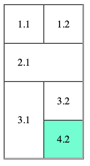

# Lenguajes de marcas: Recuperación 1ª Ev

Examen práctico de la recuperación de la primera evaluación de _Lenguajes de marcas y sistemas de gestión de la información_
No mover los archivos de sitio.

## Contenidos:

- Tema 1: XML y JSON
- Tema 2: HTML
- Tema 3: CSS

## Enunciado

La prueba consta de 2 ejercicios. En el primero se pide hacer una conversión a .xml y a .json y en el seguno ejercicio se va a crear un sitio web compuesto de 3 páginas HTML y un fichero de estilos CSS.

### Ejercicio 1 (4 puntos)

Dada la estructura descrita más abajo, crear un archivo XML con dicha estructura y un archivo JSON. El XML se puede hacer con o sin atributos, a elección del alumno.

- empleado.xml(2pt)
- empleado.json(2pt)

**Estructura:**

Empleado:

- nombre: Mesi
- apellidos: Chiquito
- direccion:
  - calle: Uria 28
  - ciudad: Oviedo
- departamentos:
  - programación
  - diseño
  - análisis

## Ejercicio 2 (6 puntos)

Este ejercicio está compuesto por varios archivos, se detalla a continuación lo que se pide para cada archivo

**- inicio.html (2pt)**

- h1 con tu nombre y apellidos
- Párrafo con breve descripción sobre ti
- h2 con el texto `'Mis hobbies:'`
- lista no numerada con 3 hobbies que te gusten
- h2 con texto `'Mis series favoritas:'`
- lista numerada con tus 3 series favoritas

**- contact.html(1,5pt)**

Formulario de contacto para recopilar los siguientes datos:

- nombre
- email
- contraseña
- tipo de cliente:
  - empresa
  - particular
  - estudiante

**- tabla.html(1,5pt)**
Realizar la tabla reflejada en la siguiente imagen.

darle a la última celda la clase `azul`

**- style.css(1pt)**

- vincular todos los ficheros html a este fichero en el head.
- Hacer que los h1 tengan un tamaño de `48px`
- Hacer que las listas no numeradas sean de color `#777777`
- Hacer que los li de las listas numeradas tengan un paddin a la izquierda de `24px`
- Hacer que los elementos con la clase `azul` tengan un color de fondo de color `aquamarine`

## Entrega

Hacer commit con el mensaje `Entrega`, sincronizar los cambios y aceptar la creación de la bifurcación (fork)
